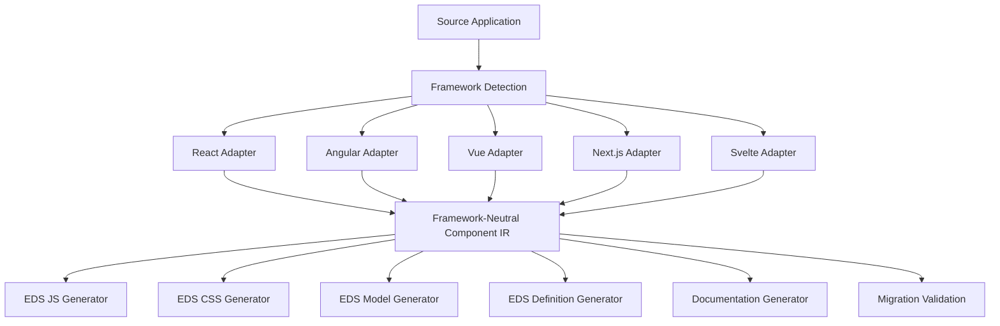

# Generic Frontend-to-EDS Migration Platform

## Architecture Requirements Brief

**Audience:** Solution Architecture and Engineering

**Purpose:** Define a generic solution for converting frontend components built with React, Angular, Vue, Next.js, or Svelte into compliant AEM Edge Delivery Services (EDS) blocks.

**Status:** Proposed

---

## 1. Executive Summary

We need a framework-independent migration platform that converts existing frontend components into production-oriented AEM Edge Delivery Services blocks.

The platform must preserve the source component's structure, visual intent, data flow, conditional behavior, repeated content, events, loading and error states, accessibility, and responsive behavior wherever those capabilities are supported by EDS.

The solution must not simply generate HTML or a parseable code scaffold. It must either:

1. Generate a behaviorally complete EDS block; or
2. Clearly identify every behavior that requires manual implementation.

The platform must use one consistent migration architecture for all supported source frameworks rather than implementing unrelated conversion logic per framework.

> The core principle is: convert component intent and behavior, not just framework syntax.

---

## 2. Business Objective

The platform should reduce the manual effort, risk, and time required to migrate frontend applications and components to AEM EDS.

It should provide a predictable migration process that:

- Supports React, Angular, Vue, Next.js, and Svelte.
- Produces EDS-compatible source code and component metadata.
- Preserves supported runtime behavior.
- Makes unsupported or ambiguous behavior visible.
- Prevents invalid block paths and incomplete imports.
- Provides enough traceability for an engineer to review and complete the migration.

---

## 3. Scope

### In Scope

- Single-component migration.
- Application-level dependency analysis.
- Framework-specific source parsing.
- Conversion of JavaScript and TypeScript components.
- Conversion of supported CSS, SCSS, CSS Modules, and CSS-in-JS output.
- Detection of child components and shared dependencies.
- Detection of API calls and data-fetching behavior.
- Generation of EDS block code and metadata.
- Generation of a migration report.
- Static validation and browser-based rendering validation.

### Out of Scope Unless Explicitly Supported

- Automatic replacement of business APIs.
- Automatic conversion of authentication systems.
- Automatic migration of server infrastructure.
- Automatic migration of framework-specific routing.
- Automatic recreation of complex global state management.
- Guaranteed conversion of server-only or framework-specific behavior.

Out-of-scope behavior must be reported rather than silently omitted.

---

## 4. Supported Input

The platform should accept a source application, repository, or component containing:

- React, Angular, Vue, Next.js, or Svelte components.
- JavaScript or TypeScript source.
- Component properties, inputs, and public interfaces.
- Child components.
- Hooks, composables, services, stores, and utility functions.
- API calls and data-fetching logic.
- Local stylesheets and style dependencies.
- Static assets and images.
- Routing and navigation references.
- Existing tests where available.

The platform should identify the source framework automatically or allow the user to select it explicitly.

---

## 5. Target EDS Output

For each migrated block, the platform should generate a structure similar to:

```text
blocks/
  component-name/
    component-name.js
    component-name.css
    _component-name.json
    components/
      child-component.js
```

The platform should also update or generate:

- `component-definition.json`
- `component-models.json`
- `component-filters.json`
- Migration documentation.
- A machine-readable migration report.
- Generated tests or test scenarios where practical.

Generated code must follow the repository's existing EDS conventions and must not modify protected EDS library files.

---

## 6. Canonical Block Naming

Block naming must be normalized once and used consistently throughout the generated output.

The canonical name must be applied to:

- Block folder.
- JavaScript filename.
- CSS filename.
- Block CSS class.
- Component model id.
- Component definition id.
- Component filter id.
- Authored markup.
- Dynamic import path.

For example, these source names must resolve to one canonical block name:

```text
ProductListing
productListing
product-listing
```

Expected canonical output:

```text
blocks/product-listing/product-listing.js
blocks/product-listing/product-listing.css
```

The generator must not produce inconsistent paths such as:

```text
blocks/productlisting/productlisting.js
```

when the canonical block is `product-listing`.

Existing authored content that uses a non-canonical name must be detected and reported with a migration action. Compatibility aliases should not be created unless explicitly approved by architecture.

---

## 7. Recommended Architecture

The platform should use framework adapters and a shared intermediate representation (IR).



The framework-specific adapters should be responsible for understanding source syntax and framework semantics. The EDS generators should operate primarily on the normalized IR.

This separation allows new source frameworks to be added without duplicating EDS generation logic.

---

## 8. Intermediate Representation Requirements

The IR should capture at least:

- Source framework and framework version.
- Source component path.
- Component name and canonical block name.
- Public properties and their types.
- Required and optional fields.
- Child components and dependency relationships.
- Repeated content and collection expressions.
- Conditional rendering branches.
- Event handlers and user interactions.
- Loading, success, empty, and error states.
- API calls and response mappings.
- Accessibility attributes.
- CSS dependencies and responsive rules.
- Asset dependencies.
- Unsupported or ambiguous expressions.
- Source-to-output traceability information.

Every generated behavior should be traceable back to a source node, expression, or dependency.

---

## 9. Behavior Preservation

The migration must preserve behavior, not only markup.

For a source expression such as:

```js
products.map((product) => <ProductCard product={product} />)
```

the generated EDS block must create and append one product card for every product.

For a conditional expression such as:

```js
product.stock > 0 ? <InStockBadge /> : <OutOfStockBadge />
```

the generated block must preserve the stock condition and both outcomes.

The generator must not replace source behavior with misleading placeholders such as:

```js
if (true) {
}
```

or:

```js
String(true)
```

If a behavior cannot be translated automatically, the platform must:

1. Preserve the closest safe behavior where possible.
2. Mark the behavior as requiring review.
3. Record the original source expression.
4. Explain the missing implementation.
5. Include the item in the migration report.
6. Prevent the migration from being marked fully complete.

Empty event handlers, empty badges, unused fields, and placeholder values must not be emitted as completed production behavior.

---

## 10. Data and API Handling

The platform must discover and classify data sources as:

- Static content.
- Authorable content.
- Runtime API data.
- Build-time data.
- Context-dependent data.
- Unsupported external dependency.

For each API dependency, the generated report must include:

- Endpoint and HTTP method.
- Query parameters.
- Required headers.
- Authentication requirements.
- Request and response shape.
- Response-to-component field mappings.
- Loading behavior.
- Empty-result behavior.
- Error behavior.
- Retry behavior.
- Caching expectations.
- CORS implications.
- Whether browser-side execution is appropriate.

The platform must not assume that a public endpoint is automatically suitable for browser-side execution.

The architecture must define how framework-specific data abstractions map to EDS. Examples include:

- React hooks such as `useFetch`.
- Angular services and observables.
- Vue composables.
- Next.js server components and data loaders.
- Svelte stores and load functions.

When no direct EDS equivalent exists, the report must state the required implementation decision.

---

## 11. Loading, Empty, Error, and Retry States

Where the source component defines asynchronous data behavior, the generated block must support explicit state transitions:

```text
idle -> loading -> success
                  |
                  +-> empty
                  |
                  +-> error -> retry -> loading
```

The loading state must not remain hard-coded after data loading completes.

The generated block must define behavior for:

- Request in progress.
- Successful response with data.
- Successful response with no data.
- Failed request.
- Retry action.
- Invalid or unexpected response shape.

---

## 12. EDS Authoring Model

The platform must derive an EDS-compatible authoring model from component properties and content structure.

It must identify whether values should be represented as:

- Text fields.
- Rich text fields.
- Images.
- Links.
- References.
- Boolean fields.
- Numeric fields.
- Enumerated options.
- Repeatable fields.
- Block configuration.
- Runtime-only values.

The model must be consistent with the generated implementation:

- Every authored field should be consumed or explicitly reported as unused.
- Every required generated value should have a source or authoring field.
- Repeatable content must be represented using the correct EDS model and filter.
- Runtime API data must not be incorrectly modeled as authored content.
- Model, definition, filter, folder, and runtime names must agree.

---

## 13. CSS, Assets, and Visual Fidelity

The platform should migrate supported styling while preserving:

- Layout.
- Typography.
- Colors.
- Spacing.
- Responsive breakpoints.
- Hover, focus, active, and disabled states.
- Component variants.
- Media queries.
- Images and other asset references.

Generated selectors must be scoped to the block.

The platform must identify styles that cannot be migrated directly, including unresolved runtime styles, framework-only style bindings, and unavailable design tokens.

A block must not be considered successfully migrated merely because its DOM renders. The generated output must also provide an appropriate visual equivalent or clearly report the missing styles.

---

## 14. Unsupported Features and Manual Review

The platform must explicitly report unsupported or partially supported features, including:

- Framework-specific lifecycle behavior.
- React hooks without an EDS equivalent.
- Angular services, dependency injection, or observables without an adapter.
- Vue composables.
- Svelte actions.
- Next.js server components.
- Server-side rendering behavior.
- Framework-specific routing.
- Context providers.
- Global state management.
- Dynamic imports.
- Authentication-dependent APIs.
- Server-only or browser-only APIs.
- Complex animation systems.
- CSS-in-JS that cannot be statically resolved.

Critical unsupported behavior must cause the migration status to be `BLOCKED` or `COMPLETED_WITH_REVIEW`. It must not be silently discarded.

---

## 15. Migration Report

For every migrated component, generate a report containing:

- Source framework and version.
- Source component path.
- Generated block path.
- Canonical block name.
- Migrated properties.
- Migrated child components.
- Migrated API dependencies.
- Migrated styles and assets.
- Preserved conditions and loops.
- Preserved events.
- Unsupported features.
- Placeholder code.
- Manual actions required.
- Validation results.
- Overall migration status.

Recommended statuses:

```text
COMPLETED
COMPLETED_WITH_REVIEW
BLOCKED
```

`COMPLETED` should only be returned when supported source behavior is preserved and all required validation passes.

For example, a Product Listing migration should report items such as:

```text
Manual review required:
- useFetch dependency was not resolved.
- Loading state was generated as a constant.
- Product stock condition was not migrated.
- Badge children were not migrated.
- Add-to-cart behavior was not migrated.
- Product card styles were not fully generated.
- Product data source requires runtime API review.
```

---

## 16. Validation Requirements

Every generated block must be validated for:

- Canonical naming.
- Correct folder and file structure.
- Valid JavaScript syntax.
- Valid CSS syntax.
- Valid JSON.
- EDS model and definition conventions.
- Correct dynamic import paths.
- Correct CSS loading paths.
- Correct child-component imports.
- Loading state.
- Success state.
- Empty state.
- Error state.
- Retry behavior.
- Responsive layout.
- Accessibility.
- Missing assets.
- Missing data bindings.
- Unsupported expressions.

The platform should provide both static validation and browser-based validation. Browser validation should verify that the generated block renders meaningful content, not merely that the module loads without throwing an exception.

---

## 17. Product Listing Reference Case

The current Product Listing migration is a useful reference case because it exposes the required platform capabilities.

The existing generated block initially had these problems:

- The original `useFetch` dependency was not migrated.
- The loading state was hard-coded.
- The repeatable card container was created but not attached to the DOM.
- Product stock conditions were replaced with parse-safe placeholders.
- Badge content was empty.
- Product availability rendered as `true` instead of a meaningful value.
- Product card styles were incomplete.
- The generated block path did not initially match the authored block name.

The generic migration platform should detect and report these issues automatically. A human should not need to discover them only after opening the rendered page.

---

## 18. Architecture Decisions Required

The solution architect should confirm:

1. Which source framework versions are supported initially?
2. Is migration performed from a complete repository, a component folder, or both?
3. Which parser or compiler strategy will be used for each framework?
4. What is the canonical intermediate representation?
5. Which framework behaviors are supported in the first release?
6. Which APIs are allowed for runtime browser calls?
7. Is there an approved backend or proxy strategy for external APIs?
8. Which product and content fields must become authorable in EDS?
9. How are authentication and secrets handled?
10. How are shared components and dependencies deduplicated?
11. How are routing and navigation migrated?
12. What is the threshold for `COMPLETED` versus `COMPLETED_WITH_REVIEW`?
13. Which validation tools are mandatory in the migration pipeline?
14. How are existing authored pages with non-canonical block names remediated?
15. How will generated output be tested across desktop and mobile viewports?

---

## 19. Acceptance Criteria

The generic migration solution is successful when:

1. It supports React, Angular, Vue, Next.js, and Svelte through framework-specific adapters.
2. All adapters produce the same framework-neutral component representation.
3. Generated blocks follow standard EDS naming and folder conventions.
4. Generated metadata matches the generated block implementation.
5. Dynamic imports never reference inconsistent or non-existent paths.
6. Supported loops, conditions, events, and state transitions are preserved.
7. Unsupported behavior is reported and never silently replaced with misleading placeholders.
8. API behavior includes loading, success, empty, error, and retry handling where applicable.
9. Generated styles are scoped and visually representative of the source component.
10. Generated output passes syntax, lint, metadata, and browser rendering validation.
11. The migration report is generated for both complete and incomplete migrations.
12. The Product Listing reference case produces complete product cards rather than partially rendered placeholder content.
13. A migration marked `COMPLETED` does not require undisclosed manual code changes to function correctly.

---

## 20. Requested Architecture Deliverables

Please provide the following as part of the solution design:

- High-level architecture diagram.
- Framework adapter responsibilities.
- Intermediate representation schema.
- EDS code-generation strategy.
- Naming and normalization rules.
- Dependency-resolution strategy.
- API and data-source strategy.
- Authoring-model derivation strategy.
- Unsupported-feature handling strategy.
- Migration-report schema.
- Validation and test strategy.
- Security and privacy considerations.
- Performance considerations.
- Phased implementation plan.
- Risks, assumptions, and recommended mitigations.

The final solution should make migration outcomes predictable, reviewable, and honest about what was or was not converted.
